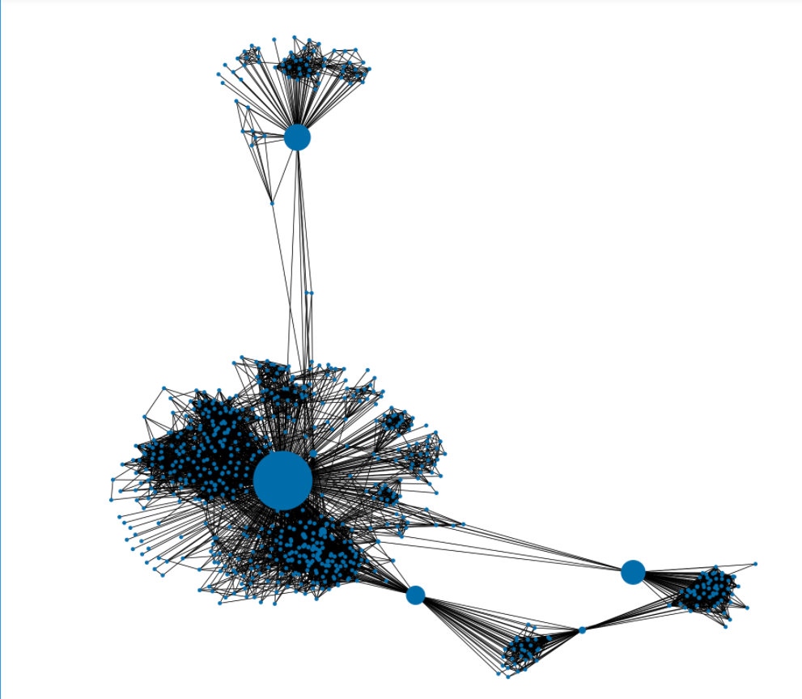

## Portfolio

---

### Showcase  

[World Happiness Exploration](https://alex-jurado.medium.com/brief-exploration-on-world-happiness-a9ee5dc061ca)

Explored the state of world happiness and built an interactive dashboard with heroku with some interactive data visualizations and animations.

---
[News Summarizer](/pdf/Daily_Report.pdf)

Using Transformers (BART, and BERT) built a text scrapper that scrapes news papers, cleans them and then generates summaries and word clouds and puts them into a pdf which is then emailed.

---
[PageRank algorithm and centrality](https://www.linkedin.com/feed/update/urn:li:activity:6786286772243439617/)

Using the PageRank algorithm to visualize and analize a Facebook newtwork of friends. 

---
[Predicting customer churn](https://github.com/Stereo-Alex/Customer_churn_prediction)

Exploring the data and creating a machine learning model to predict future customer churn

---
[Visualizing Michigan's economic performance](https://coursera.org/share/668bf9fc48e2b5e88685b1fc34f3ce4e)

As part of the final project for Applied Plotting, Charting and Data Representation by University of Michigan and Coursera I decided to explore Michigan's Economic performance using visualizations. 

---
[The Barcelona Unemployment mistery](https://docs.google.com/presentation/d/1vyFAfJ942_LL3OzIL6IDuPePlSYvXTUKddT0wSBAVE8/edit?usp=sharing)

Data analysis into unemployment in Barcelona

---

[Guess The number / Binary algorithm](https://github.com/Stereo-Alex/Project-Week-1-Build-Your-Own-Game)

Simple game of guess the number where the computer can also play using a binary algorithm

---

### Repositories / Interesting links

- [World Happiness Exploration](https://github.com/Stereo-Alex/Project-Week-5-Your-Own-Project/)
- [World Happiness Exploration Dashboard](https://interactive-dash-ironhack.herokuapp.com/)
- [PageRank Repository](https://github.com/Stereo-Alex/Graph_Algorithms)
- [Predicting customer churn](https://github.com/Stereo-Alex/Customer_churn_prediction)
- [Visualizing Michigan's economic performance](https://github.com/Stereo-Alex/Coursera/blob/main/Applied%20plotting%20/Week%204/Assignment4.ipynb)
- [News Summarizer](https://github.com/Stereo-Alex/Project-Week-8-Final-Project)
- [The Barcelona Unemployment mistery](https://github.com/Stereo-Alex/Project-Week-2-Barcelona)
- [Guess The number / Binary algorithm](https://github.com/Stereo-Alex/Project-Week-1-Build-Your-Own-Game)

---

### Relevant Self-learning Course Certificates 

- [Applied Data Science With Python (Specialization)](https://www.coursera.org/account/accomplishments/specialization/GQRBCA6Y9EXT)
- [Statistics With Python](https://www.coursera.org/account/accomplishments/specialization/Z3TENQPSK5W2)
- [Introduction to Data Science by I.B.M. (Specialization)](https://coursera.org/share/e455bfa0e9856874e4309521a79a949f)
- [Data Science Math Skills by Duke University](https://coursera.org/share/a1d492e540895052e723a69302a49a00)

<!-- Remove above link if you don't want to attibute -->
